# BLE Tracker Base - Configurable Real-Time Beacon Tracking System

**Author:** Christian Zeh  
**Company:** NGIS PTE LTD  
**Contact:** info@ng-is.com  
**Repository:** https://github.com/thetechbrainhub/BLE_Tracker_Base-configurable-main

---

## ⚠️ License & Proprietary Notice

This software is proprietary and confidential. All source code, documentation, and derived works are protected intellectual property of NGIS PTE LTD.

**COPYING, REDISTRIBUTION, MODIFICATION, OR COMMERCIAL USE OF THIS SOFTWARE WITHOUT EXPLICIT WRITTEN PERMISSION FROM NGIS PTE LTD IS STRICTLY PROHIBITED.** Unauthorized use may result in legal action.

For licensing inquiries or permission to use this software, please contact: **info@ng-is.com**

---

## Overview

The BLE Tracker Base is an advanced real-time beacon tracking system designed for service worker localization and hazard zone monitoring. It uses Bluetooth Low Energy (BLE) scanning combined with Meshtastic mesh networking to provide reliable proximity detection and status updates with minimal bandwidth consumption.

The system tracks multiple workers in hazardous areas, detects entries and exits from safety zones, and sends event-based notifications via mesh network. It features dynamic runtime configuration without recompilation, persistent storage of settings, and intelligent beacon rotation on the display when multiple workers are detected.

### Key Capabilities

The system continuously scans for BLE beacons and processes distance measurements through a sophisticated filtering pipeline. Kalman filtering smooths noisy RSSI measurements while maintaining responsiveness to rapid changes. The tracked beacon system maintains awareness of which worker is closest while intelligently detecting when workers enter or leave the monitored zone. Zone composition is only transmitted when actual changes occur, dramatically reducing network traffic.

When multiple beacons are detected within the monitoring threshold, the display rotates between them every two seconds to show all active workers. The system stores all configuration parameters persistently in NVS (Non-Volatile Storage), meaning settings survive power cycles. A comprehensive JSON-based command system allows real-time parameter adjustments through the Meshtastic UART interface without requiring recompilation or restart.

---

## System Architecture

```mermaid
graph TB
    BLE["🔵 BLE Scanner"]
    RSSI["📡 RSSI Measurement"]
    KALMAN["🔧 Kalman Filter"]
    DISTANCE["📏 Distance Conversion"]
    FILTER["🎯 Device Filter"]
    TRACKER["👥 Beacon Tracker"]
    ZONE["🗺️ Zone Detection"]
    JSON["📦 JSON Encoder"]
    EVENT["⚡ Event Detector"]
    MESHTASTIC["📡 Meshtastic UART"]
    DISPLAY["🖥️ OLED Display"]
    NVS["💾 NVS Storage"]
    CONFIG["⚙️ ConfigManager"]
    
    BLE --> RSSI
    RSSI --> KALMAN
    KALMAN --> DISTANCE
    DISTANCE --> FILTER
    FILTER --> TRACKER
    TRACKER --> ZONE
    ZONE --> EVENT
    EVENT -->|Zone Changed| JSON
    JSON --> MESHTASTIC
    ZONE --> DISPLAY
    
    CONFIG -.->|Load Settings| RSSI
    CONFIG -.->|Load Settings| DISTANCE
    CONFIG -.->|Load Settings| FILTER
    CONFIG -.->|Load Settings| DISPLAY
    CONFIG <-->|Persist| NVS
    MESHTASTIC -->|JSON Commands| CONFIG
    
    style BLE fill:#4da6ff
    style ZONE fill:#ff9933
    style EVENT fill:#ff6666
    style MESHTASTIC fill:#33cc33
    style DISPLAY fill:#ffff99
    style NVS fill:#9966ff
```



---

## Installation & Setup

### Hardware Requirements

The system is optimized for the Seeed XIAO ESP32-S3 development board, which provides the necessary BLE capabilities and GPIO pins. The system requires a Meshtastic device connected via UART (typically serial) for mesh communication. Any BLE beacons compatible with standard Bluetooth 5.0 will work, including smartphones, dedicated beacon devices, or IoT sensors.

For development and testing, you'll need the Arduino IDE or Platform IO IDE with ESP32 support. Connection to a 128x64 pixel OLED display via I2C shows real-time beacon information and status.

### Installation Steps

Download or clone this repository to your development environment. Install Platform IO if not already present, then open the project and install dependencies through the Platform IO library manager. The project uses ArduinoJson for JSON parsing and U8g2 for OLED display support.

Connect your hardware according to the pinout specified in `Config.h`. By default, UART1 uses GPIO pins 43 (TX) and 44 (RX) for Meshtastic communication. The I2C display typically uses GPIO 21 (SDA) and GPIO 22 (SCL), but these can be reconfigured in the code.

Flash the firmware using Platform IO: Open a terminal in the project directory and execute `pio run -t upload`. The system will begin BLE scanning immediately upon startup and display connection status on the OLED screen.

---

## Core Components

### BLE Scanner

The BLE scanner continuously searches for advertising devices and measures signal strength. It runs a configurable scan cycle that balances power consumption against detection speed. Each detected beacon's RSSI (Received Signal Strength Indication) is measured and converted to distance using the log-distance path loss model with environmental correction factors.

The scanner applies a device filter to only process beacons matching MAC addresses in the whitelist. This dramatically reduces processing load and focuses on relevant workers. Active scanning mode requests additional information from beacons but consumes more power, while passive mode just listens to advertisements and uses less power.

### Distance Calculation

The system converts RSSI measurements to distance using the formula: `distance = 10^((TX_POWER - RSSI) / (10 * N))`, where TX_POWER is the calibrated transmission power at 1 meter and N is the environmental factor. The TX_POWER is typically between -50 and -70 dBm depending on the beacon type.

The environmental factor varies based on surroundings. In free space (outdoors), use 2.0. In typical indoor environments with some obstacles, 2.5 to 3.0 is appropriate. In dense indoor environments with many walls and reflections, values up to 4.0 may be needed. The distance correction parameter allows fine-tuning the calculated distance to match your specific environment.

### Kalman Filter

Raw RSSI measurements contain noise and variability. The Kalman filter provides optimal smoothing by estimating both the current distance and the measurement uncertainty. Process noise controls how quickly the filter responds to actual changes, while measurement noise controls how much the filter trusts new measurements.

Higher process noise makes the filter follow changes more quickly but produces noisier output. Higher measurement noise makes the filter trust measurements less and produces smoother output. The default values (0.01 and 0.5) provide good balance for typical beacon tracking applications.

### Beacon Tracker

The tracker maintains state about which beacon is currently being monitored and detects when beacons enter or leave the zone. It tracks the closest beacon within the distance threshold and detects when it disappears by monitoring the last seen timestamp.

When a beacon hasn't been detected for longer than the beacon timeout (default 10 seconds), the system assumes the worker has left the zone and sends a disappearance notification. If the beacon reappears, the system sends a reappearance notification. This mechanism prevents false alerts from brief signal dropouts.

### Zone Composition Detection

The system tracks which beacons are currently within the monitoring zone. Whenever a beacon enters the zone or any beacon exits, an event is triggered. The zone update is transmitted only when composition actually changes, dramatically reducing unnecessary messages on the mesh network.

This event-based approach means you get immediate notification when workers enter or leave the hazard area, but you don't receive repeated messages if workers are stationary. This makes the system efficient for both bandwidth and power consumption.

### Display System

The OLED display shows gateway information in the header, the current beacon name in large text, presence status, distance in large numbers, and time since last update in small text. When multiple beacons are detected in the zone, the display automatically rotates between them every two seconds, showing all active workers.

The display remains on while workers are present and turns off when the zone is empty. If a worker disappears, an alert screen shows "TECHNICIAN GONE" for five seconds before turning off, ensuring critical status changes are always noticed.

---

## Dynamic Configuration System

### Configuration Management

All system parameters are stored in two places: the compiled defaults in `Config.h` for initial values, and the ESP32 NVS (Non-Volatile Storage) for persistent runtime values. On startup, the system loads saved values from NVS, allowing parameters to survive power cycles.

Changes made via JSON commands are immediately applied and automatically saved to NVS. This means you can adjust beacon timeout, distance threshold, or filter settings without recompiling or restarting the system. The next time the device powers on, it will have your custom settings.

### JSON Command Format

All configuration commands use JSON format sent via UART to the Meshtastic interface. Each command must include a `target` field that matches the gateway ID. If the gateway receives a command with a different target, it ignores the message (useful when multiple gateways are on the same mesh network).

The system responds to every configuration command with an acknowledgment in JSON format indicating success or failure. This allows remote monitoring systems to confirm that settings were applied correctly.

### Gateway Identification

The system uses a unique gateway ID to identify itself on the mesh network and to validate incoming configuration commands. The gateway ID is stored persistently and displayed in the log output and on the OLED header. By default, it's "TRAC 001" but can be changed via the `set_gateway_id` command.

The gateway ID can contain spaces and alphanumeric characters. It's used in acknowledgment messages and in zone update broadcasts, so all monitoring clients know which gateway is reporting the data.

---

## Configuration & Command Reference

### Quick Configuration Table

| Parameter | JSON Key | Type | Range | Default | Effect |
|-----------|----------|------|-------|---------|--------|
| **Gateway ID** | `gateway_id` via `set_gateway_id` | string | 1-32 chars | "TRAC 001" | Identifies gateway on mesh network |
| **Scan Duration** | `scan_time` | int | 1-30 | 5 | BLE scan time in seconds per cycle |
| **Scan Interval** | `scan_interval` | int | 50-1000 | 100 | Interval between scan cycles (0.625ms units) |
| **Scan Window** | `scan_window` | int | 50-1000 | 99 | Duration of each scan window (0.625ms units) |
| **Active Scanning** | `active_scan` | bool | true/false | true | Request additional info (higher power) |
| **TX Power** | `tx_power` | int | -100 to 20 | -59 | Beacon transmission power at 1m (dBm) |
| **Environmental Factor** | `env_factor` | float | 1.5-4.0 | 2.7 | Path loss exponent (higher = more obstacles) |
| **Distance Threshold** | `distance_threshold` | float | 0.1-10.0 | 1.0 | Maximum distance for zone detection (meters) |
| **Distance Correction** | `distance_correction` | float | -2.0 to 2.0 | -0.5 | Fine-tuning adjustment for distance calc |
| **Process Noise** | `process_noise` | float | 0.001-0.5 | 0.01 | Kalman filter response speed |
| **Measurement Noise** | `measurement_noise` | float | 0.1-2.0 | 0.5 | Kalman filter trust in measurements |
| **Window Size** | `window_size` | int | 2-20 | 5 | Moving average smoothing window |
| **Beacon Timeout** | `beacon_timeout` | int | 5-60 | 10 | Seconds before declaring beacon absent |
| **MAC Filter Enable** | `mac_enable` | bool | true/false | true | Enable/disable device whitelist filtering |

### Command Examples & Explanations

#### Set Gateway ID

```json
{"target":"TRAC 001","CMD":"set_gateway_id","value":"MACHINE_A"}
```

This changes the gateway identifier from "TRAC 001" to "MACHINE_A". Useful when deploying multiple gateways in different areas. The change is persistent and will survive power cycles.

Expected response:
```json
{"ack":"MACHINE_A","ok":true}
```

#### Add Beacon MAC Address

```json
{"target":"TRAC 001","mac_add":"e0:80:8f:1e:13:28"}
```

Whitelist a specific beacon by adding its MAC address to the filter. The system will now scan for this device. Use this when you want to track specific workers and ignore all others. MAC addresses are case-insensitive (automatically converted to lowercase).

Expected response:
```json
{"ack":"TRAC 001","ok":true}
```

Current filter becomes: `08:05:04:03:02:01,0d:03:0a:02:0e:01,e4:b0:63:41:7d:5a,e0:80:8f:1e:13:28`

#### Remove Beacon MAC Address

```json
{"target":"TRAC 001","mac_remove":"e0:80:8f:1e:13:28"}
```

Stop tracking a specific beacon by removing it from the whitelist. Useful when a worker stops using a particular beacon or you want to focus on a different worker.

Expected response:
```json
{"ack":"TRAC 001","ok":true}
```

#### Clear All MAC Addresses

```json
{"target":"TRAC 001","mac_clear":true}
```

Remove all entries from the beacon whitelist. After this, no beacons will be detected until new ones are added. Useful when switching from tracking one set of workers to another.

Expected response:
```json
{"ack":"TRAC 001","ok":true}
```

#### Adjust Distance Threshold

```json
{"target":"TRAC 001","distance_threshold":0.5}
```

Change the maximum distance for zone detection to 0.5 meters. Only beacons closer than this distance will be considered in-zone. Smaller values require workers to be closer to be tracked. Useful for fine-tuning based on your specific hazard area size.

Expected response:
```json
{"ack":"TRAC 001","ok":true}
```

#### Adjust Beacon Timeout

```json
{"target":"TRAC 001","beacon_timeout":15}
```

Increase the time before declaring a beacon absent to 15 seconds. This prevents false "gone" alerts from brief signal dropouts. Larger values are more tolerant of interference but slower to detect actual departures.

Expected response:
```json
{"ack":"TRAC 001","ok":true}
```

#### Optimize for Noisy Environment

```json
{"target":"TRAC 001","measurement_noise":1.2,"env_factor":3.5}
```

Increase measurement noise to 1.2 (trust measurements less, more smoothing) and environmental factor to 3.5 (account for more obstacles). Useful in industrial environments with many reflections and interference.

Expected response:
```json
{"ack":"TRAC 001","ok":true}
```

#### Optimize for Responsive Tracking

```json
{"target":"TRAC 001","process_noise":0.05,"measurement_noise":0.3}
```

Increase process noise and decrease measurement noise for faster response to beacon movement. Good for active tracking scenarios where quick updates are important.

Expected response:
```json
{"ack":"TRAC 001","ok":true}
```

#### Enable/Disable MAC Filtering

```json
{"target":"TRAC 001","mac_enable":false}
```

Disable the MAC address filter to track ALL beacons in range, not just whitelisted ones. Useful for discovery or testing. Be warned: this can produce high processing load if many devices are nearby.

Expected response:
```json
{"ack":"TRAC 001","ok":true}
```

#### Adjust Active Scanning

```json
{"target":"TRAC 001","active_scan":false}
```

Disable active scanning mode to reduce power consumption. The system will only listen to beacon advertisements rather than requesting additional information. Reduces power but may miss some beacons.

Expected response:
```json
{"ack":"TRAC 001","ok":true}
```

#### Fine-Tune Distance Calculation

```json
{"target":"TRAC 001","distance_correction":-0.8}
```

Apply a -0.8 meter correction to all distance calculations. Useful if the system consistently reports distances that are too far or too close. Test with a beacon at a known distance and adjust this value until it reads correctly.

Expected response:
```json
{"ack":"TRAC 001","ok":true}
```

---

## Zone Updates & Event System

### Zone Composition Changes

The system tracks which beacons are currently within the monitoring zone. Zone updates are sent **only when the composition changes**, not on every measurement cycle. This event-driven approach dramatically reduces mesh network traffic.

When a beacon enters the zone, an immediate update is sent showing all current beacons. When a beacon leaves the zone, another update is sent with the reduced list. The format is compact JSON designed to fit within the 200-byte Meshtastic message limit.

### Zone Update JSON Format

The system sends individual zone events as devices enter or leave the monitored zone. Each event is a separate JSON object transmitted immediately when the event occurs.

**When a device ENTERS the zone (present:true):**
```json
{"zone":"TRAC 001","n":"NGIS 004","d":0.41,"present":true}
```

**When a device LEAVES the zone (present:false):**
```json
{"zone":"TRAC 001","n":"NGIS 004","present":false}
```

The `zone` field identifies which gateway sent the update. The `n` field is the device name, `d` is the distance in meters (only included for entering devices), and `present` indicates the device status. When a device leaves, the distance field is omitted since the device is no longer in range.

### Compact Payload Design

Each zone event is approximately 50-80 bytes depending on device name length, staying well under the 200-byte Meshtastic limit. Multiple events may be batched in a single transmission, separated by line breaks (`\r\n`). Monitoring systems should parse each line as a separate JSON object.

**Example batch transmission:**
```json
{"zone":"TRAC 001","n":"NGIS 004","d":0.41,"present":true}
{"zone":"TRAC 001","n":"WHOOP 4C0762464","d":0.68,"present":true}
```

---

## Display & UI

### Display Layout

The display is divided into three sections. The top 12 pixels contain the gateway identifier and a separator line. The middle section shows the beacon name in large 17-point font (left-aligned) and takes up about 20 pixels. Below that is a separator line, and the lower section shows distance in very large 22-point font (about 30 pixels) and last-update time in small 12-point font (10 pixels).

When multiple beacons are in the zone, the display rotates every two seconds, automatically cycling through all active beacons. This allows monitoring staff to see that multiple workers are present and their individual distances.

### Beacon Rotation

Rotation only occurs when two or more beacons are detected. The system maintains an index that increments every two seconds and wraps around to show each beacon in sequence. This provides automatic awareness of multiple concurrent workers without manual controls.

### Alert Behavior

If a tracked beacon suddenly disappears (timeout exceeded), the display switches to a prominent "TECHNICIAN GONE" alert screen for five seconds. This ensures that departures are always noticed and visible. After five seconds, the display turns off if no other beacons are in the zone.

When the beacon reappears, normal monitoring resumes immediately. This behavior helps identify workers who unexpectedly left the hazard area.

---

## Power Consumption & Performance

### Scanning Cycle

The default configuration uses a 5-second scan with 100-unit intervals. This means the system is actively scanning for 5 seconds, then rests for about 62.5 milliseconds before starting the next scan. Adjusting scan time and interval trades off between responsiveness and power consumption.

For battery-powered applications, reduce `scan_time` to 2-3 seconds and increase interval to 200-300 units. For continuous monitoring on powered hardware, increase `scan_time` to 10+ seconds for more thorough scanning.

### Filtering Efficiency

Using MAC address filtering with just 3-4 specific beacons is far more efficient than scanning for all devices. With filtering enabled, the system processes only the relevant beacons and skips others. Without filtering on a busy RF environment, processing load increases dramatically.

### Kalman Filter Performance

The Kalman filter provides real-time optimal smoothing with minimal CPU overhead. It's much more efficient than moving average filters of equivalent smoothing strength. The filter runs in microseconds per measurement, making it negligible impact on overall system performance.

---

## Data Format & Persistence

### NVS Storage

Configuration values are stored in the "ble_config" namespace of ESP32's NVS. Each parameter is stored with a short key name to conserve storage space. The system can store approximately 100+ parameter updates before NVS fills up on typical ESP32 boards.

Values are automatically retrieved on startup, restoring your configuration settings even after power loss. Manual parameter edits to `Config.h` are overridden by NVS values, so changes must be made via JSON commands if you want persistence.

### JSON Parsing

The system uses ArduinoJson library with a 200-byte document buffer. This limits individual JSON commands to approximately 200 bytes including formatting. Most configuration commands are well under this limit, so this is rarely a practical constraint.

Malformed JSON or JSON exceeding buffer size is gracefully ignored with an error logged. The system will respond with `"ok":false` if parsing fails.

---

## Troubleshooting & Optimization

### No Beacons Detected

Verify the MAC addresses in the whitelist match your beacon devices exactly (case-insensitive but must match). Check that active scanning is enabled if beacons aren't responding to scan requests. Try `mac_enable:false` temporarily to scan for all devices and identify what's nearby.

If still no beacons, check UART connection and baud rate. Verify beacons are actually advertising (check beacon app or logs). Try reducing the distance threshold to ensure beacons are within range.

### Inaccurate Distance Readings

Measure beacons at known distances (1m, 2m, 3m) and compare readings. Adjust `env_factor` up for more obstacles or down for clearer space. Use `distance_correction` for fine-tuning. Higher `measurement_noise` reduces jitter but adds lag. Experiment with `process_noise` to find the right balance.

### Frequent False "Gone" Alerts

Increase `beacon_timeout` to 15-20 seconds to tolerate brief signal dropouts. Increase `measurement_noise` and `env_factor` to account for interference. Check for other RF devices causing interference on 2.4 GHz.

### High Processor Load

Reduce `scan_time` or increase `scan_interval`. Enable MAC filtering if disabled. Check serial output for excessive logging. Reduce `window_size` if using moving average smoothing. Ensure only necessary beacons are whitelisted.

### Lost Configuration After Power Cycle

Configuration is stored in NVS automatically after every successful command. If NVS isn't working, check that the device isn't failing to initialize the Preferences library. Try sending a simple test command and confirm the device responds with success. If NVS is consistently failing, there may be a hardware issue with the flash storage.

---

## Technical Specifications

- **Supported Hardware:** ESP32 with BLE capability (tested on Seeed XIAO ESP32-S3)
- **BLE Range:** 10-100+ meters depending on beacon and environment
- **Scanning Modes:** Active and passive, configurable
- **Distance Accuracy:** ±0.2-0.5 meters at calibrated distance
- **Zone Update Latency:** <500ms from zone change to transmission
- **Memory Usage:** ~80 KB program memory, ~40 KB RAM
- **UART Baudrate:** 115200 bps (Meshtastic default)
- **Display:** 128x64 pixel OLED via I2C
- **Configuration Parameters:** 17 runtime-adjustable settings
- **Maximum Zone Size:** 1-10 meters (configurable)
- **Simultaneous Beacons:** Unlimited tracking, 5-6 display simultaneously

---

## Support & Further Assistance

For technical support, configuration assistance, or licensing inquiries, please contact **NGIS PTE LTD** at **info@ng-is.com**.

This software is provided as-is for authorized users only. Modification, redistribution, or unauthorized use is strictly prohibited.

---

**Last Updated:** November 2025  
**Version:** 2.0.0 - Dynamic Configuration System  
**Status:** Production Ready